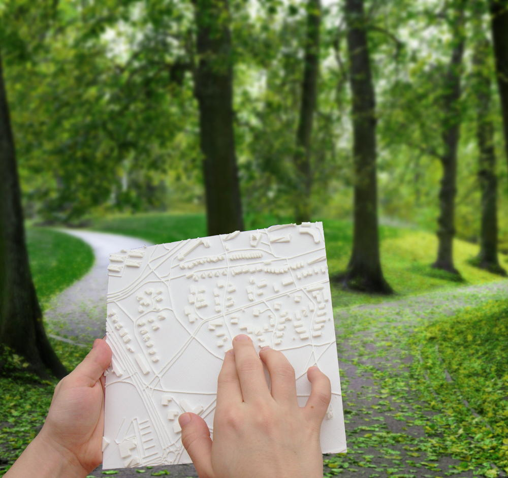
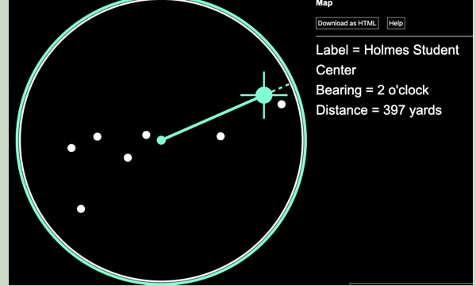
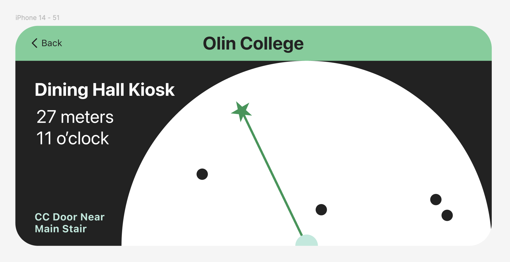

Entering an unfamiliar indoor space presents a unique challenge for blind and low-vision people: not just moving safely, but understanding where things are and how the space is organized. For sighted people, a quick look at a floor plan or across a room can convey layout, scale, and orientation; for those who are blind or low-vision, this type of spatial overview is rarely available. This blog post explores existing blind accessible navigation and object recognition technologies, and how the recent rise in commercially available high-resolution cameras and LiDAR-enabled smartphones, combined with advances in image recognition models and large-scale, open-source location data, can create new opportunities for blind-accessible indoor mapping.

### Navigation vs. Mapping

------------------------------------------------------------------------

#### Navigation

Navigation is the task of following directions. Questions like: *How do I get to Starbucks? Which turn should I take next? How long will it take to get to Room 344?* can all be answered with navigation. Blind accessible navigation systems require a higher level of detail than sighted systems. To use a navigation system, the user needs to have a specific starting and ending point already chosen.

------------------------------------------------------------------------

#### Mapping

Mapping, for the purposes of this article, is the process of gaining an understanding of a space. It involves developing a mental model of what is around you: the relative positions of objects, the size and shape of barriers (e.g. walls), and how different areas relate to one another. Mapping supports questions like: *What is in this room? What shops are around me on this street? How big is this space? Where might I want to go next?* Mapping systems are used to get a sense of an area, and are often used to choose an ending point to be used in navigation.

------------------------------------------------------------------------

Both navigation and mapping occur at multiple scales. If you are attending a conference at UBC, you may need directions to UBC, directions to the room of your conference, and directions to your table. Similarly, you may want a map to gain insight into the organization of buildings across campus (e.g. to find a nearby coffee shop), the floor plan of the building you are entering (e.g. to know which door to enter by, or where the check-in desk will be), and the layout of the tables within the conference room.

### Blind Accessible Navigation Technology

------------------------------------------------------------------------

#### Lazarillo and BlindSquare

Applications such as Lazarillo and BlindSquare provide turn-by-turn directions, nearby points of interest, and contextual information using precise GPS and digital map data. The two popular apps have very similar technology and feature set. Both determine your location using GPS, then gather open-source information about addresses and businesses nearby. They both provide blind-friendly, hyper-specific directions ( precise distance estimates and information about stairs, doors, intersections, etc) and can announce points of interest as you navigate.

------------------------------------------------------------------------

#### Apple and Google Maps

Popular navigation application have been increasing their accessibility features as well. Google Maps now offers more detailed voice guidance, frequent updates, and new types of verbal announcements for walking trips through an optional setting. Both Google and Apple Maps released AR features ('Live View' and 'Refine Location', respectively) that compare your phone camera to street view data to pinpoint a more accurate location and orientation around 2021, but neither feature has really taken off. These features have promise for blind-friendly navigation, though neither Google or Apple Maps seems to be developing them towards this use case.

------------------------------------------------------------------------

#### WeWalk Smartcane

Significant research has focused on computer vision and sensor-based tools for indoor navigation and obstacle avoidance to augment the traditional white cane. Products like the WeWalk smart cane use sensors to warn users of overhead obstacles (a primary drawback of traditional canes) and provide navigation directions that avoid large obstacles like furniture.

------------------------------------------------------------------------

#### SeeingAI

Lastly, there has also been significant development in close up object identification. Applications like SeeingAI can read text, identify small objects, and describe photos. Google Images and other mainstream image applications have introduced similar features for advanced image recognition.

------------------------------------------------------------------------

Notice how these tools all focus on immediate interaction rather than spatial understanding. They help users avoid or identify things, but not necessarily get a sense of how those things are arranged.

### Blind Accessible Mapping Technology

------------------------------------------------------------------------

#### Tactile Maps

Figure 1. A tactile map of an outdoor area. Image depicts someone reading a tactile map, with trails, roads, and buildings represented as raised lines and cubes on a square, on a trail in a park. Source: https://touch-mapper.org/en/

One of the most established non-visual approaches to spatial understanding is the tactile map. These maps use raised lines, textures, and braille labels to represent walls, pathways, landmarks, and boundaries. When available, tactile maps can be extremely effective tools for building spatial awareness before or during exploration.

Despite their usefulness, tactile maps have significant limitations. They are relatively rare, often fixed in place, and typically only available in select public spaces. Creating a tactile map is expensive and time-consuming, making updates difficult.

Additionally, tactile maps often require a sighted intermediary during creation. Visual layouts must be interpreted, translated, and validated by someone who can see the blueprints, visual maps, or photos of the area. This process limits scalability and autonomy. Overall, tacticle maps lack many advantages of digital systems: easy duplication, real-time updates, portability, and possible integrations with smartphone sensors.

------------------------------------------------------------------------

#### MicroSoft Soundscape / Voice Vista

The discontinued Microsoft Soundscape was published as an open-source project and picked up to create the Voice Vista app. This technology implements the idea of a "soundscape" for both mapping and navigation. As the user holds their phone up with the camera facing out and moves around, they get non-voice audio and haptic cues about their surroundings. Voice Vista focuses primarily on navigation, using these queues to provide non-text audio directions, but also attempts to give its users a heightened sense of their environment and help forming mental maps.

------------------------------------------------------------------------

### Our Design

#### Image Recognition, LIDAR, and precise GPS

High-resolution smartphone cameras, on-device image recognition, and LiDAR depth sensors—now present in mainstream smartphones—enable rich environmental sensing without specialized hardware. At the same time, improvements in inertial measurement units and precise positioning allow devices to estimate orientation and relative movement with increasing accuracy.

Many of the previously discussed blind-accessible applications already make use of these technologies for navigation and object recognition. Our idea is to use the same technologies, but at a different scale. Rather than focusing on moment-by-moment descriptions and directions, our project explores how image recognition, LiDAR, and motion sensing can create a virtual representation of a space with appropriate detail for a blind user.

#### "Virtual Cane" Extension

The conceptual foundation for this work comes from cane-based exploration. When using a cane, a blind person builds spatial understanding through repeated sweeps, gradually integrating distance, direction, and object presence into a coherent mental map.

Figure 2. Perkins' Non-Visual Digital Map using the SAS Graphics Accelerator. A circle with points in it, and one point highlighted with a line from the center point to that point. A text label to the right of the image reads "Label = Holmes Student Center, Bearing = 2 o'clock, Distance = 397 yards".

The original inspiration for this concept is from Perkins' Non-Visual Digital Map, developed using the SAS Graphics Accelerator. Their work introduces a “virtual cane” model in which users explore large areas by sweeping through directions and receiving audio feedback. Our approach builds on this idea, implementing it at a smaller scale (identifying indoor features, rather than buildings) and automating the map creation process.

By combining LiDAR-enabled cameras, inertial sensing, and image recognition, we are working on an automated system that identifies nearby objects—such as furniture, doorways, bathrooms, counters, and signs—and represents them as directional-distance vectors relative to the user. As the user slowly turns in place with their smartphone, the system detects landmarks using image recognition and places them within a local coordinate frame, using inertial sensing for direction and LiDAR for distance estimates.

Compared to tactile maps, the vector based map is an ideal format to leverage smartphone cameras because it is easy to create using the normal forward facing camera position (while tactile maps would likely require birds eye photos). As such, our system not only builds on the traditional sweeping cane experience to *communicate* the map, but also the traditional sweeping video taking experience to *create* the map.

#### Vector Based Map

Figure 3: A vector based non-visual map depicting a semi-circle with dots scattered throughout. One dot is highlighted with a green star, and a line is depicted from the center of the circle to that dot. Text on the screen reads "Olin College, Dining Hall Kiosk, 27 meters, 11 o'clock, CC Door Near Main Stair".

Because this system is designed for non-visual use first, interaction design is critical. In our prototype, users explore the map through left and right swiping gestures. Swiping cycles through detected points of interest, announcing each item’s identity, distance, and direction. This interaction is inspired by smartphone screen readers, such as VoiceOver, which use swiping motions to navigate the phone. For low vision users, an additional visual layer uses high-contrast colors and large shapes to augment the audio information, as in Perkins' design.

A critical component of the sighted mapping experience is the ability to review maps away from the mapped location. Unlike navigation directions, maps must be persistent digital objects. A user can save each map they create in our app with a descriptive name tied to a specific location and orientation, e.g. facing forward in a particular doorway. Like sighted maps, our maps can be reused, compared, and shared.

### Looking Forward

Indoor mapping for blind and low-vision users remains an open and largely unexplored design space. By applying new visual sensing and data processing technologies to a familiar non-visual mental model, our work proposes one path toward more accessible indoor mapping. Rather than translating visual maps into accessible formats, it begins with how cane users already understand space and builds technology around that logic.

### References

https://www.blindsquare.com/

https://www.seeingai.com/

https://www.bemyeyes.com/

https://lazarillo.app/

<https://www.perkins.org/resource/lazarillo-free-accessible-gps-app-blind-and-visually-impaired/>

https://www.applevis.com/apps/ios/navigation/voicevista

https://touch-mapper.org/en/

https://www.esri.com/about/newsroom/arcnews/tactile-maps-built-with-gis-help-people-who-are-blind-gain-spatial-awareness

https://www.perkins.org/resource/getting-started-non-visual-digital-maps/

<https://blog.google/products-and-platforms/products/maps/better-maps-for-people-with-vision-impairments/>

<https://techcrunch.com/2020/06/25/apple-maps-to-tell-you-refine-location-by-scanning-the-skyline/>

<https://geospatialworld.net/prime/business-and-industry-trends/what-is-visual-positioning-system-vps/>

<https://www.tdk.com/en/featured_stories/entry_084-WeWALK-Smart-Cane-2.html>

<https://wewalk.io/en/>
